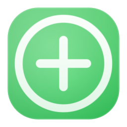

# Macsimize



Customise Dock icon click, double-click, and scroll actions on macOS.

[Download Page](https://apotenza92.github.io/macsimize/) · [GitHub Releases](https://github.com/apotenza92/macsimize/releases) · [Buy me a coffee](https://buymeacoffee.com/apotenza)

## Install

### Homebrew

```bash
brew tap apotenza92/tap
brew install --cask apotenza92/tap/macsimize
```

Beta can be installed side by side with stable:

```bash
brew tap apotenza92/tap
brew install --cask apotenza92/tap/macsimize@beta
```

### Manual install

1. Download the latest zip from the [download page](https://apotenza92.github.io/macsimize/) or [GitHub Releases](https://github.com/apotenza92/macsimize/releases).
2. Move `Macsimize.app` (or `Macsimize Beta.app`) to `/Applications`.
3. Launch once and grant permissions.

## Required macOS Permissions

- Accessibility
- Input Monitoring

System Settings paths:

- `Privacy & Security > Accessibility`
- `Privacy & Security > Input Monitoring`

## Build

```bash
xcodebuild -project Macsimize.xcodeproj -scheme Macsimize -configuration Debug build
```

## Test

```bash
xcodebuild test -project Macsimize.xcodeproj -scheme Macsimize -destination 'platform=macOS' CODE_SIGNING_ALLOWED=NO
```

## Support

If Macsimize is useful to you, you can support the project here:

[Buy me a coffee](https://buymeacoffee.com/apotenza)
